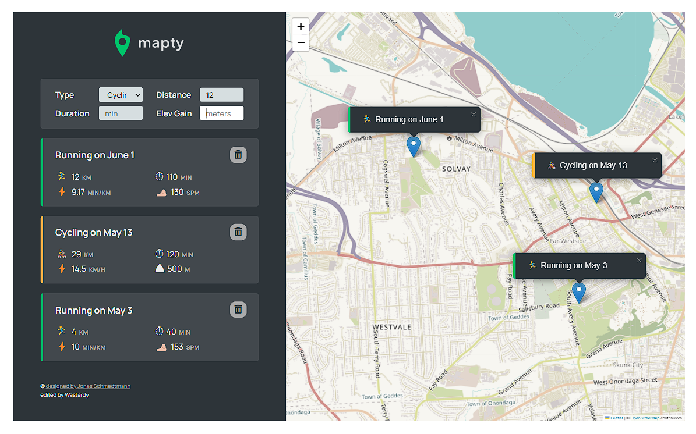

# Workout Tracker

Web application for tracking workouts on a map using geolocation.

## Features
- Detects the user's current location
- Interactive map integration with Leaflet.js
- Add workouts (running or cycling)
- Delete workout from form
- Automatically saves workouts in LocalStorage
- Displays workouts in a list and on the map
- Move the map to a specific workout by clicking on it
- Reset all workouts

## Technologies Used
- HTML, CSS
- JavaScript (ES6+)
- Leaflet.js for interactive mapping
- LocalStorage for workout persistence

## How to Use
1. Open the application in a browser
2. Allow location access
3. Click on the map to add a workout
4. Fill out the form and press "Enter"
5. View workouts in the list in form and on the map
6. Click on a workout in the list to move the map to its location
7. Use `app.reset()` in the console to clear all workouts and reload page

## Installation & Running
1. Download or clone the repository.
2. Open `index.html` in a browser.

## Future Improvements
- Use a server-side database for persistent workout storage
- Improve responsive design for mobile devices
- Additional filters and workout statistics